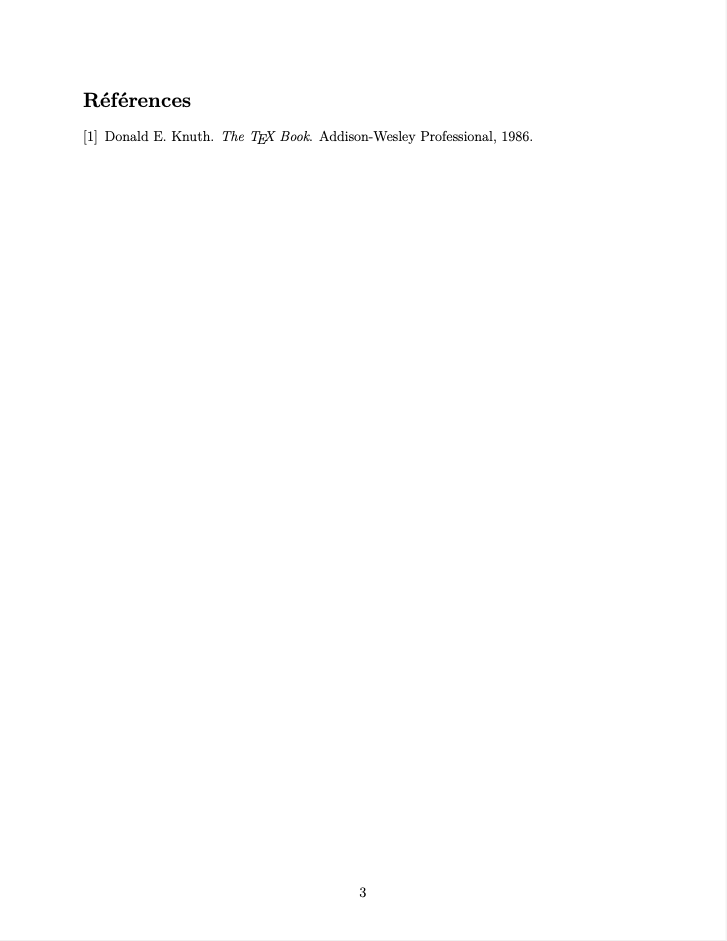

# UniTeX

UniTeX is a collection of scientific oriented and minimalistic [LaTeX](https://www.latex-project.org/) templates suitable for many assignement types.

 

## Table of contents

- [Requirements](#requirements)
- [Installation](#installation)
- [Quick start](#quick-start)
- [Screenshots](#screenshots)
- [Features](#features)

  - [x] 'Classic' template & Makefile
  - [ ] 'Article' template
  - [ ] 'Homework' template
  - [x] Bash install script
  - [ ] Test on fresh Linux and Mac OS (Docker)
  - [ ] README
  - [ ] Man pages for different OS

- [Credits](#credits)

## Requirements

UniTeX requires a complete TeX distribution (you can find the most used TeX distributions
[here](https://www.latex-project.org/get/#tex-distributions)). Most features need external tools such as latexmk that fully automates LaTeX document generation. Latexmk is usually part of TeX distributions like MikTeX and MacTeX but you can always install it by following [these](https://mg.readthedocs.io/latexmk.html) steps.

A Unix shell is also required to install UniTeX properly and build it's templates. A pdf viewer like [Skim](https://skim-app.sourceforge.io/),
[Zathura](https://pwmt.org/projects/zathura/index.html) and [SumatraPDF](https://www.sumatrapdfreader.org/free-pdf-reader) is also fun to have
when working on LaTeX projects.

## Installation

The ideal way to install UniTeX templates is via the install script `install.sh`.

```shell
$ git clone https://github.com/BCarnaval/UniTeX
...
$ cd UniTeX && chmod +x install.sh && ./install.sh
```

By doing it like so, you will be able to use UniTeX command such as `unitex -build ...` and others.

## Quick start

Once [installation](#Installation) properly done and `unitex -v` command outputs no error, you can directly build
your first UniTeX template by following

1. Create a folder (**test** in home folder for the example) in which store template's files that you will actually edit.

```shell
$ mkdir ~/test
```

2. Build your template inside this directory using `unitex` by specifying the flags **-b build**: template (classic, article, homework), **-d directory** directory in which build it (use directory created in step 1.) and **-o opt** building option.

```shell
$ unitex -b classic -d ~/test -o dry
```

Here, the `dry` option means that latexmk will not compile your project continuously and not clean the directory either. To clean it, you must use the option **clean** with the `-o` flag. These commands being done (`dry` and `clean`), you should see the following inside your **test** folder

```shell
$ ls ~/test
Makefile
PageTitre.tex
colors.sty
commands.sty
figs
main.pdf
main.tex
refs.bib
sections
style.sty
```

3. If you read this I am assuming that your **test** directory isn't missing any files and you now are ready to configure/customize the template to satisfy the nature of your project. To do this, you simply open your favorite text editor and remove default values from `PageTitre.tex`, `main.tex`, all the files inside `sections/` and `figs/` directories, references from `refs.bib` and feel free to add your personnal commands inside `commands.sty`.

## Screenshots

Example of what you should get from 'classic' template and Yale's darkblue as main color

<table>
  <tr>
    <td>Default title page</td>
    <td>Sections layout</td>
  </tr>
  <tr>
    <td></td>
    <td></td>
  </tr>
 </table>

<table>
  <tr>
    <td>Maths display</td>
    <td>References</td>
  </tr>
  <tr>
    <td></td>
    <td></td>
  </tr>
 </table>

## Features

## Credits
